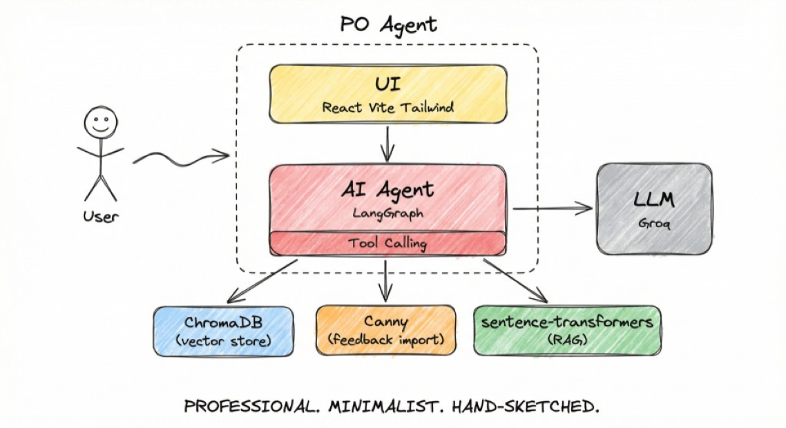

# Product Owner AI Agent

[](https://www.python.org)
[](https://fastapi.tiangolo.com)
[](https://langchain-ai.github.io/langgraph)
[](LICENSE)

<p align="center">
  
</p>

**Assistant IA pour Product Owner** : analyse de feedback, priorisation (RICE, MoSCoW, WSJF), génération de user stories Jira-ready.

*Feedback → Insights → Priorisation → User Stories Jira-ready* · [Architecture](docs/architecture.md) · [Pipeline agentique](docs/agentic.md)

## Fonctionnalités

| Catégorie | Fonctionnalité | Statut |
|-----------|----------------|--------|
| **Feedback Analysis** | Traitement emails/tickets/commentaires | JSONL, CSV |
| | Import Canny (feedback existant) | API Canny |
| | Identification de patterns | InsightAgent |
| | Extraction de feature requests | FeedbackAgent (LLM) |
| **Prioritization** | Scoring (RICE, WSJF) | |
| | Frameworks MoSCoW | |
| | Justification des recommandations | rationale + Explainability |
| **Assisted Writing** | User stories structurées | StoryAgent |
| | Critères d'acceptation | Gherkin-style |
| | Estimation de complexité | XS/S/M/L/XL |

## Quickstart

**Première fois** → [Quickstart complet](docs/quickstart.md) (prérequis, config `.env`, lancement)

```bash
cp .env.example .env   # ajouter GROQ_API_KEY (gratuit : console.groq.com)
make start
```

→ http://localhost:5173 (UI) • http://localhost:8000 (API)

**Docker** : `cp .env.example .env` → éditer `.env` (GROQ_API_KEY) → `docker-compose up` — UI sur http://localhost:80

### Variables d'environnement principales

| Variable | Rôle | Requis |
|----------|------|--------|
| `GROQ_API_KEY` | Clé API Groq (LLM) | Oui |
| `OPENAI_API_KEY` | Clustering sémantique InsightAgent | Non |
| `USE_CHROMA` | Persistance RAG cross-sessions | Non (défaut: true) |
| `MAX_FEEDBACKS` | Limite feedbacks par analyse (défaut: 100) | Non |
| `CORS_ORIGINS` | Origines autorisées (prod: restreindre, pas `*`) | Non |
| `RATE_LIMIT_PER_MIN` | Requêtes/min par IP (0 = désactivé) | Non |

Voir [.env.example](.env.example) pour la liste complète.

## Démo

**Démo one-click** : `make start` → page Feedback → bouton « Démo one-click » (GROQ_API_KEY requis)

**Manuel** : « Charger l'exemple » ou uploade un fichier JSONL/CSV

1. Cliquez **Lancer l'analyse**
2. Explore Insights, Roadmap, Backlog, User Stories
3. **Diff Critique** : avant/après raffinement (reasoning loop)
4. **What-if** : modifie Impact/Effort pour recalcul RICE en temps réel
5. Télécharge le CSV Jira (onglet Stories)

## Livrables

- **Code source** : architecture modulaire (domain, agents, llm, ingestion, export)
- **Démo fonctionnelle** : API Swagger + UI React
- **Documentation** : voir [docs/README.md](docs/README.md)
  - [Architecture](docs/architecture.md) — flux, diagrammes, couches
  - [Architecture agentique](docs/agentic.md) — pipeline LangGraph, agents, tool calling
  - [Stack technique](docs/tech-stack.md) — technologies, versions
  - [Quickstart](docs/quickstart.md) — installation, première analyse
- **Tests** : `make test` (Python) • `cd apps/web && npm run test` (frontend Vitest)
- **i18n** : Interface en français et anglais (bouton FR/EN dans la sidebar)
- **Pre-commit** : `make install-hooks` — Ruff + ESLint avant chaque commit
- **Changelog** : [CHANGELOG.md](CHANGELOG.md)
- **Contribution** : [CONTRIBUTING.md](CONTRIBUTING.md)

## Agents (pipeline LangGraph)

| Agent | Rôle |
|-------|------|
| FeedbackAgent | Feedback → AnalyzedFeedback (catégorie, feature requests) |
| InsightAgent | Clustering & consolidation des demandes |
| PriorityAgent | RICE, WSJF, MoSCoW + justification LLM |
| **RetrievalAgent** | RAG — features similaires pour enrichir le contexte |
| StoryAgent | User stories Jira-ready |
| **CritiqueAgent** | Reasoning loop — critique et affine les stories |
| SynthesisAgent | Résumé exécutif roadmap |

**RAG** : `pip install -e ".[rag]"` pour activer (sentence-transformers). Sinon, no-op.

**Chroma** : `make start` installe RAG + Chroma par défaut. Persistance cross-sessions dans `./data/chroma` — aucune clé API.

### Options avancées

| Variable / action | Effet | Clé API ? |
|-------------------|-------|-----------|
| `pip install -e ".[rag]"` | RAG (RetrievalAgent) — features similaires dans les stories | Non |
| `pip install -e ".[chroma]"` | Vector store persistant cross-sessions | **Non** |
| `USE_CHROMA=true` | Active Chroma (enrichit le RAG avec l'historique) | Non |
| `OPENAI_API_KEY` | Clustering sémantique InsightAgent | Oui (optionnel) |

## Structure

```
po_agent/
├── core/         config, validation
├── domain/       models, scoring RICE/WSJF/MoSCoW, rules
├── ingestion/    loader (JSONL/CSV), canny_loader
├── llm/          client, chat, prompts
├── agents/       feedback, insight, priority, retrieval, story, critique, synthesis, orchestrator
├── intelligence/ roadmap, embeddings, whatif, vector_store, tools
├── pipelines/    run (full, stream, partial)
├── evaluation/   metrics (qualité stories)
└── export/       jira_export

apps/
├── api/          main, routes, deps, rate_limit
└── web/          UI React (Vite)
```

## Dépannage

| Problème | Solution |
|----------|----------|
| **Erreur au lancement** | Vérifier Python 3.10+, Node 18+. |
| **API injoignable** | Vérifier que l'API tourne (`make run` ou `uvicorn apps.api.main:app --port 8000`). En dev, Vite proxy `/api` → `localhost:8000`. |
| **GROQ_API_KEY requis** | Créer une clé sur [console.groq.com](https://console.groq.com), l'ajouter dans `.env`, relancer. |
| **429 Too Many Requests** | Quota Groq ou rate limit dépassé. Attendre 1 min ou augmenter `RATE_LIMIT_PER_MIN`. |
| **Erreur Canny** | Vérifier `CANNY_API_KEY` et `CANNY_BOARD_ID` dans `.env`. |
| **Chroma / RAG échoue** | `pip install -e ".[chroma]"`. Vérifier `./data/chroma` accessible en écriture. |
| **Docker : rate limit inefficace** | Configurer le proxy pour passer `X-Forwarded-For` (client réel). |
