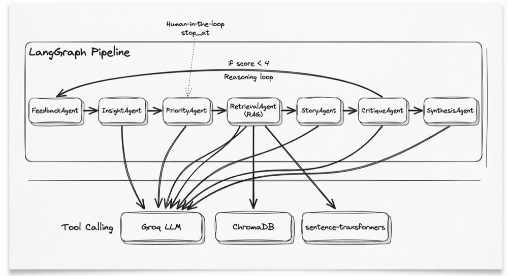

# Architecture agentique — PO Agent

## Vue d'ensemble

Le PO Agent repose sur un **pipeline LangGraph** orchestrant 7 agents spécialisés. Chaque agent a un rôle précis et transmet un état typé au suivant. L'ensemble forme un workflow de bout en bout : du feedback brut aux user stories Jira-ready.

---

## Schéma du pipeline agentique

---

## Les agents

| Agent | Entrée | Sortie | Rôle |
|-------|--------|--------|------|
| **FeedbackAgent** | FeedbackItem[] | AnalyzedFeedback[] | Catégorise, extrait les feature requests via LLM |
| **InsightAgent** | AnalyzedFeedback[] | Insight[] | Clustering sémantique, consolidation des demandes similaires |
| **PriorityAgent** | Insight[] | BacklogItem[] | Scoring RICE/WSJF, MoSCoW, justification LLM |
| **RetrievalAgent** | BacklogItem[] | enrichissement | RAG — features similaires (ChromaDB + embeddings) |
| **StoryAgent** | BacklogItem[] | UserStory[] | User stories As a / I want / So that, critères Gherkin |
| **CritiqueAgent** | UserStory[] | UserStory[] | LLM-as-a-judge, raffinement si score < 4 (reasoning loop) |
| **SynthesisAgent** | Backlog + roadmap | summary | Résumé exécutif |

---

## Tool Calling

Le pipeline s'appuie sur plusieurs **outils** :

| Outil | Rôle | Clé API |
|-------|------|---------|
| **Groq** | LLM pour Feedback, Priority, Story, Critique, Synthesis | `GROQ_API_KEY` |
| **ChromaDB** | Vector store pour RAG cross-sessions | — |
| **sentence-transformers** | Embeddings (all-MiniLM-L6-v2) | — |
| **Canny** | Import feedback existant (optionnel) | `CANNY_API_KEY` |

---

## Reasoning loop (CritiqueAgent)

Le **CritiqueAgent** applique un raisonnement itératif :

1. Chaque user story est notée 1–5 (clarté, testabilité, alignement).
2. Si score < 4 **et** passes < 2 → raffinement via LLM.
3. Sinon → passage au SynthesisAgent.

Cela améliore la qualité des stories sans boucle infinie.

---

## Human-in-the-loop

Le pipeline supporte un arrêt intermédiaire pour validation PO :

- `stop_at=insights` : revue des insights avant priorisation.
- `stop_at=backlog` : revue du backlog avant génération des stories.

---

## LangGraph : pourquoi ?

| Aspect | Bénéfice |
|--------|----------|
| **État typé** | State dict clair, débogage facile |
| **Conditional edges** | Branchement CritiqueAgent → StoryAgent ou SynthesisAgent |
| **Streaming** | Résultats progressifs côté UI |
| **Tests** | Chaque node testable isolément |
