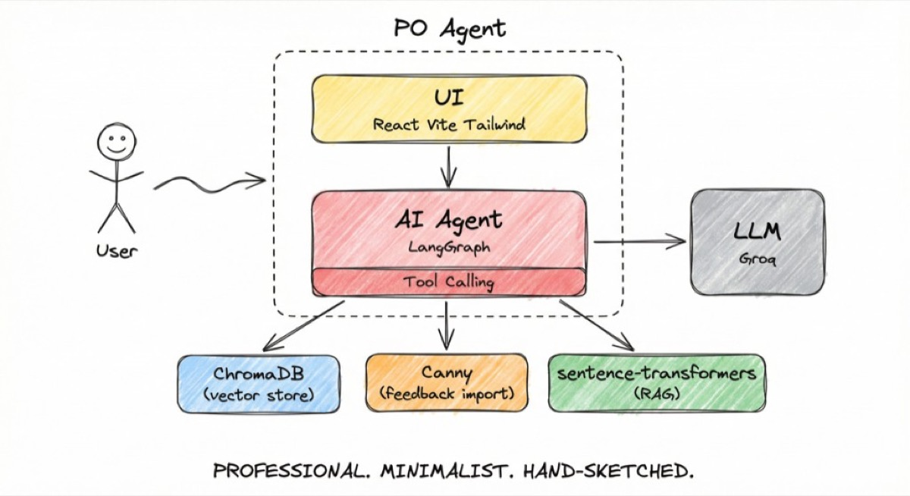
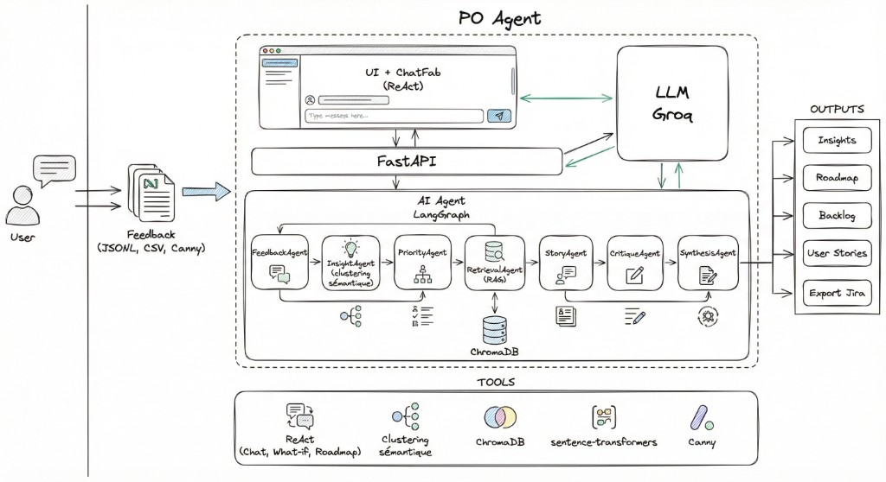
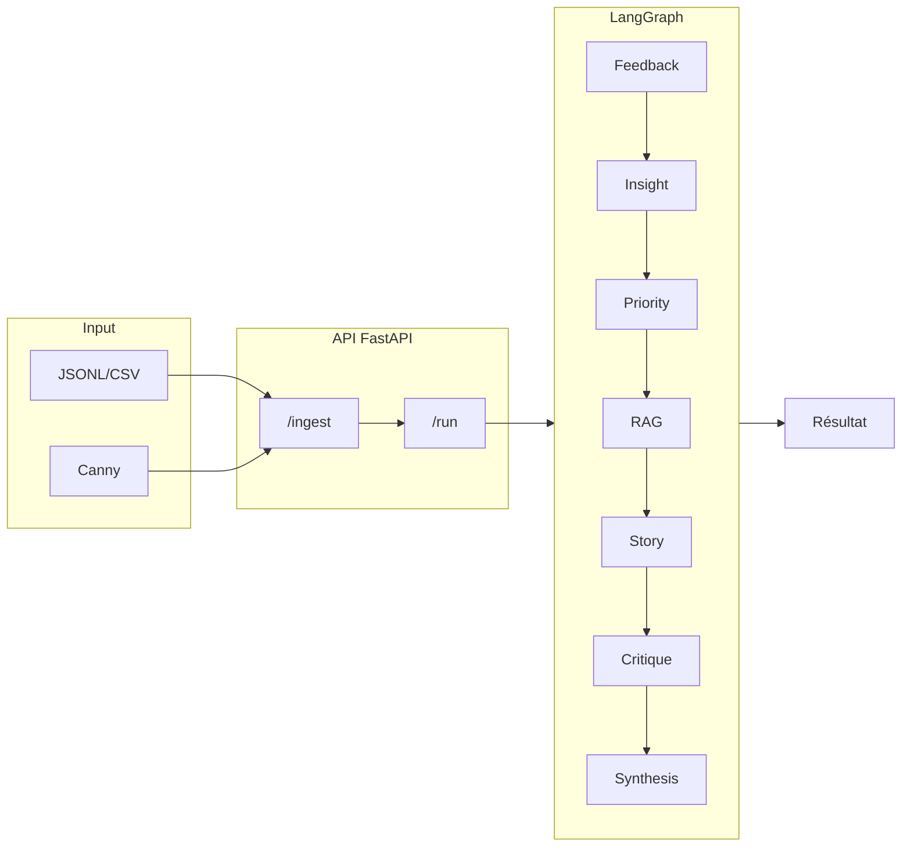
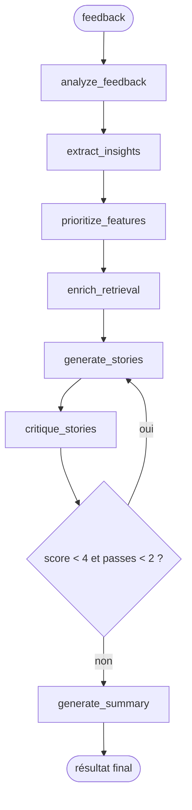
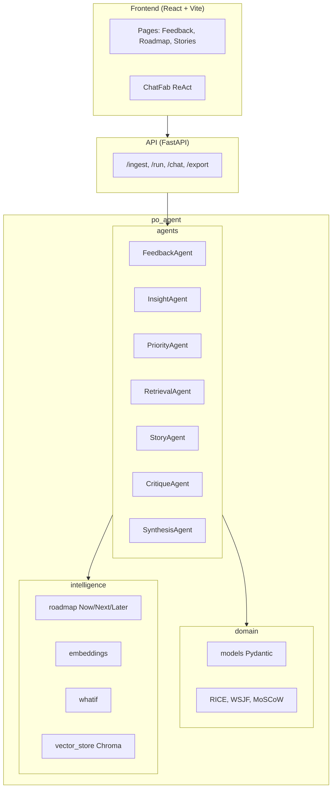

# Architecture — PO Agent

## Vision

Assistant IA qui décharge le PO sur trois piliers : **analyse de feedback**, **priorisation data-driven**, **rédaction de user stories** prêtes pour Jira.

---

## Schéma technique (vue d'ensemble)

### Vue stack (User → UI → AI Agent → LLM → outils)

### Vue flux (Input → Pipeline 7 agents → Outputs)

*[Détail agentique](agentic.md) · [Schéma interactif](architecture-diagram.html)*

---

## Flux global

---

## Pipeline LangGraph (détail)

---

## Couches applicatives

---

## Agents & rôles

| Agent | Entrée | Sortie | Rôle |
|-------|--------|--------|------|
| **FeedbackAgent** | FeedbackItem[] | AnalyzedFeedback[] | Catégorie, feature requests (LLM) |
| **InsightAgent** | AnalyzedFeedback[] | Insight[] | Clustering sémantique, consolidation |
| **PriorityAgent** | Insight[] | BacklogItem[] | RICE, WSJF, MoSCoW (domain + LLM) |
| **RetrievalAgent** | BacklogItem[] | enrichissement | RAG — features similaires |
| **StoryAgent** | BacklogItem[] | UserStory[] | Stories Jira-ready (LLM) |
| **CritiqueAgent** | UserStory[] | UserStory[] | LLM-as-a-judge, raffinement |
| **SynthesisAgent** | Backlog + roadmap | summary | Résumé exécutif |

---

## Décisions techniques

| Choix | Raison |
|-------|--------|
| **LangGraph** | Orchestration claire, états typés, conditional edges, débogage |
| **Domain pur** | RICE, WSJF, MoSCoW calculés sans LLM → testable, reproductible |
| **Pydantic** | Outputs structurés validés, prêt pour intégration |
| **Groq** | API gratuite, latence faible |
| **Human-in-the-loop** | `stop_at=insights|backlog` — revue PO avant stories |

---

## Frameworks de priorisation

- **RICE** : (Reach × Impact × Confidence) / Effort
- **WSJF** : Cost of Delay / Effort  
- **MoSCoW** : Must / Should / Could / Won't (mappé depuis RICE par quartiles)

---

## Robustesse

| Aspect | Implémentation |
|--------|----------------|
| Limites | MAX_FEEDBACKS, MAX_TEXT_LENGTH, MAX_INGEST_SIZE_MB |
| Validation | `validate_and_prepare_feedback()` — tronque, limite |
| Résilience | Erreurs isolées par item, partial success, state["errors"] |
| Batching | FeedbackAgent : lots de 3 pour réduire appels LLM |
