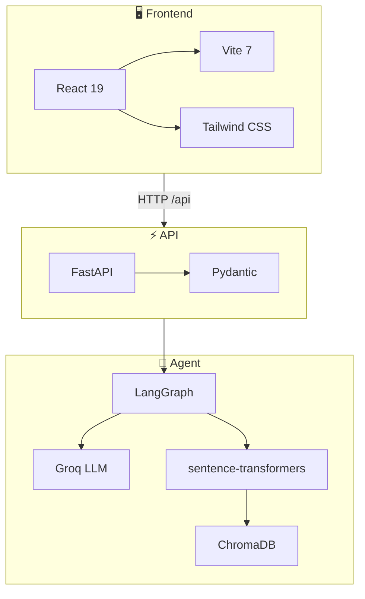

# Stack technique

## Stack visuelle (logos)

<p align="center">
  <a href="https://www.python.org"></a>
  <a href="https://fastapi.tiangolo.com"></a>
  <a href="https://langchain-ai.github.io/langgraph"></a>
  <a href="https://console.groq.com"></a>
  <a href="https://www.sbert.net"></a>
  <a href="https://docs.trychroma.com"></a>
  <a href="https://react.dev"></a>
  <a href="https://vitejs.dev"></a>
  <a href="https://tailwindcss.com"></a>
  <a href="https://docs.pydantic.dev"></a>
</p>

> *Cliquez sur un badge pour accéder à la documentation officielle.*

---

## Comment les technos se connectent



| Connexion | Détail |
|-----------|--------|
| **Frontend → API** | Appels REST sur `/ingest`, `/run`, `/chat`, `/export` |
| **API → LangGraph** | Pipeline déclenché par les routes FastAPI |
| **LangGraph → Groq** | Appels LLM pour Feedback, Priority, Story, Critique, Synthesis |
| **LangGraph → RAG** | Embeddings (sentence-transformers) + recherche (ChromaDB) |

---

## Vue d'ensemble

| Couche | Technologie | Version | Rôle |
|--------|-------------|---------|------|
| **Backend** | Python | 3.10+ | API, pipeline IA |
| **API** | FastAPI | 0.109+ | REST, validation Pydantic |
| **Orchestration** | LangGraph | 0.0.20+ | Pipeline agentique |
| **LLM** | Groq | API | Modèles Llama (gratuit) |
| **RAG** | sentence-transformers | 2.2+ | Embeddings all-MiniLM-L6-v2 |
| **Vector store** | ChromaDB | 0.4+ | Persistance RAG (optionnel) |
| **Frontend** | React | 19 | UI |
| **Build** | Vite | 7 | Bundler frontend |
| **Styling** | Tailwind CSS | 3.4 | UI |

---

## Références officielles

| Techno | Documentation |
|--------|---------------|
| **FastAPI** | [fastapi.tiangolo.com](https://fastapi.tiangolo.com) |
| **LangGraph** | [langchain-ai.github.io/langgraph](https://langchain-ai.github.io/langgraph) |
| **Groq** | [console.groq.com](https://console.groq.com) |
| **ChromaDB** | [docs.trychroma.com](https://docs.trychroma.com) |
| **sentence-transformers** | [sbert.net](https://www.sbert.net) |
| **React** | [react.dev](https://react.dev) |
| **Vite** | [vitejs.dev](https://vitejs.dev) |
| **Pydantic** | [docs.pydantic.dev](https://docs.pydantic.dev) |

---

## Dépendances Python (pyproject.toml)

```
pydantic>=2.5.0
openai>=1.0.0        # client Groq (API compatible)
fastapi>=0.109.0
uvicorn[standard]
langgraph>=0.0.20
python-dotenv
requests
```

**Optionnelles** :
- `.[rag]` — sentence-transformers (RetrievalAgent)
- `.[chroma]` — chromadb + sentence-transformers
- `.[dev]` — pytest, ruff, pre-commit
